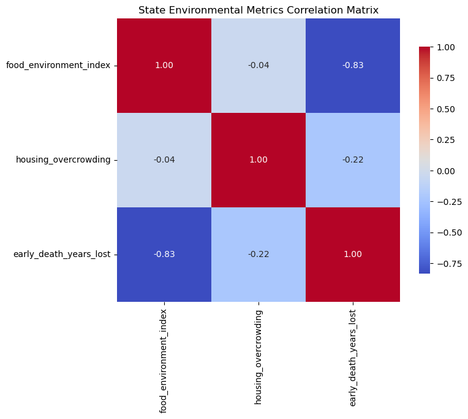
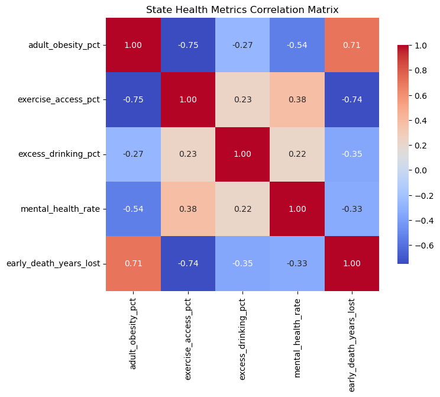
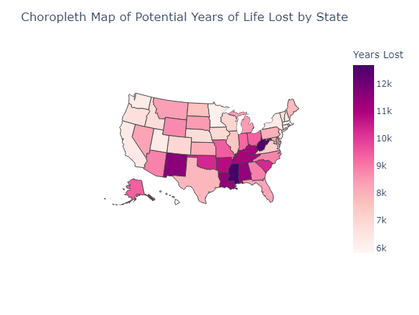
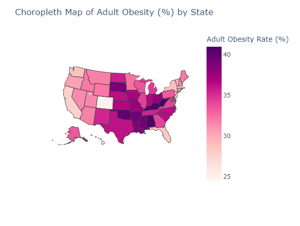
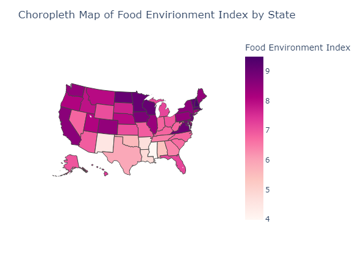
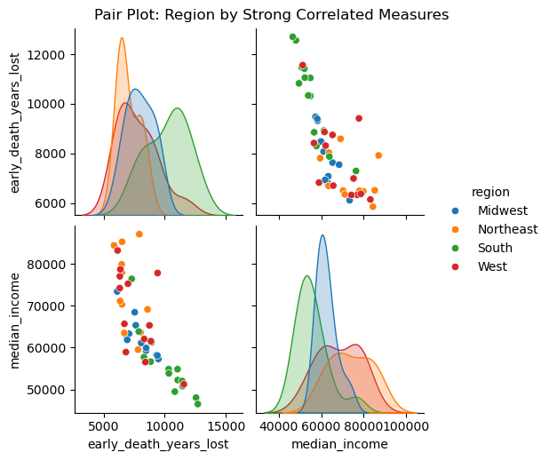

# United States Health Outcomes Report

## Summary
The United States is a wealthy country that struggles to be healthy. While the obesity rate is [flattening](https://www.cbsnews.com/news/obesity-rate-us-adults-cdc-data-map/) thanks to new medications, America is still behind its counterparts in [nearly all measures](https://www.commonwealthfund.org/publications/fund-reports/2024/sep/mirror-mirror-2024?utm_source=twitter&utm_medium=social&utm_campaign=Improving+Health+Care+Quality). Inspired by this, our group based our questions around determining which factors seem to have the biggest impact on health incomes, in this case early mortality and years of life lost. Specifically, we wanted to explore the relationships between socioeconomic, lifestyle, and health resource factors with early mortality in the United States.

Our study found that the factors most strongly impacting early mortality at the state level were **median household income**, **adult obesity**, and **food environment**. This suggests that economic resources, lifestyle choices, and access to healthy food play a pivotal role in determining public health outcomes. For example, income disparities likely exacerbate health inequalities by limiting access to preventive healthcare and healthy living conditions, while high rates of obesity reflect broader lifestyle and environmental challenges that contribute to early deaths. Addressing these key factors could lead to substantial reductions in premature death rates, particularly in economically disadvantaged areas.

## Question Responses

### Which are the most impactful factors on early mortality in the United States?

We found that the most impactful factors on early mortality in the United States are **food environment**, **median household income**, and **adult obesity rate**. The **food environment index** had a Spearman correlation coefficient of -0.8077 (p < .001), indicating a strong negative correlation. This suggests that better access to healthy, affordable food is strongly associated with lower early mortality rates. States with higher food environment index scores, meaning better access to nutritious food, tend to have lower premature death rates, highlighting the critical role nutrition plays in public health outcomes.

The **adult obesity rate** had a Spearman correlation coefficient of 0.7132 (p < .001), demonstrating a strong positive correlation with early mortality. This indicates that states with higher obesity rates tend to experience significantly higher rates of premature death. Obesity is linked to numerous chronic conditions, including heart disease and diabetes, which are major contributors to early death.

Finally, **median household income** had the strongest correlation with early mortality, with a Spearman correlation coefficient of -0.765 (p < .001). This strong negative correlation shows that higher income levels are strongly associated with lower rates of premature death. Wealthier populations likely have better access to healthcare, healthier living environments, and resources that support healthier lifestyle choices, all of which contribute to longer life expectancy.

### How do socioeconomic factors impact early mortality in the United States, and how strong is the correlation?

The socioeconomic factors we focused on were **median household income**, **income inequality**, **unemployment**, **housing overcrowding and inadequacy**, and **health insurance rate**. Of these factors, only the **food environment index** showed a significant correlation with early mortality (Spearman -0.8077, p < 0.001). This finding highlights the importance of access to healthy food in reducing premature deaths. Surprisingly, **income inequality** and **housing inadequacy** did not show strong correlations, suggesting that while these factors may contribute to general quality of life, their direct impact on early mortality is less pronounced.

### How do lifestyle factors impact early mortality in the United States, and how strong is the correlation?

The lifestyle factors we focused on were **adult obesity**, **excess drinking**, **physical activity level**, **smoking**, and **poor mental and physical health days**. Among these, the most impactful lifestyle factors were **adult obesity** and **poor physical health days**.

**Adult obesity** had the strongest correlation with early mortality, with a Spearman correlation coefficient of 0.7132 (p < .001), indicating a strong positive correlation. This suggests that states with higher obesity rates experience significantly higher rates of premature death, likely due to the increased prevalence of chronic conditions such as heart disease and diabetes in these populations.

**Poor physical health days** also showed a notable correlation with early mortality (Spearman 0.68, p < 0.001). Although the strength of this relationship is somewhat limited by the original study design (self-reported measures), it provides insight into the broader relationship between lifestyle-related health conditions and premature death.

In contrast, **excess drinking**, **physical activity levels**, and **smoking** showed weaker correlations with early mortality. While these factors are known contributors to long-term health issues, their direct impact on premature death rates in our analysis was less pronounced compared to obesity and self-reported health conditions.

### How do resource factors impact early mortality in the United States, and how strong is the correlation?

The resource access factors we examined were **food environment index**, **exercise access**, **primary care physician access**, **dental care access**, and **mental health care access**. Of these, only the **food environment index** showed a strong Spearman correlation with early mortality (-0.75, p < 0.001). This suggests that access to healthy food plays a critical role in reducing early mortality, whereas access to other resources like healthcare and exercise facilities, while important, may not have as strong a direct impact on premature deaths.

### How do these relationships vary by geographic regions across the United States?

To view how health measures performed over geographic areas, we used choropleth maps. First, we looked at overall early mortality rates:

We see that the **Southern United States** exhibits higher rates of early mortality. This may be due to the poor health metrics found in these states. For example, an obesity choropleth map shows that the South has significantly higher obesity levels:

This area was also noted to have poor food access, as shown below:

We also divided states into regions and created pair plots to show how the South struggles while the **Northeast** and **West Coast** perform better, and the **Midwest** is mixed. For example, the plot below shows the relationship between early death and median income:

### Conclusion

In conclusion, our analysis reveals that socioeconomic and lifestyle factors play a crucial role in early mortality across the United States. The strongest predictors of premature death are **median household income**, **adult obesity**, and the **food environment index**, indicating that economic resources and healthy living conditions are vital for improving public health outcomes. The Southern U.S. shows particularly poor outcomes, driven largely by high obesity rates and poor food access.

Addressing these disparities will require targeted interventions focused on improving access to healthy foods, reducing obesity rates, and addressing the broader economic inequalities that affect health outcomes. By improving these key areas, particularly in economically disadvantaged regions, policymakers can make significant strides in reducing premature deaths and improving public health overall.
